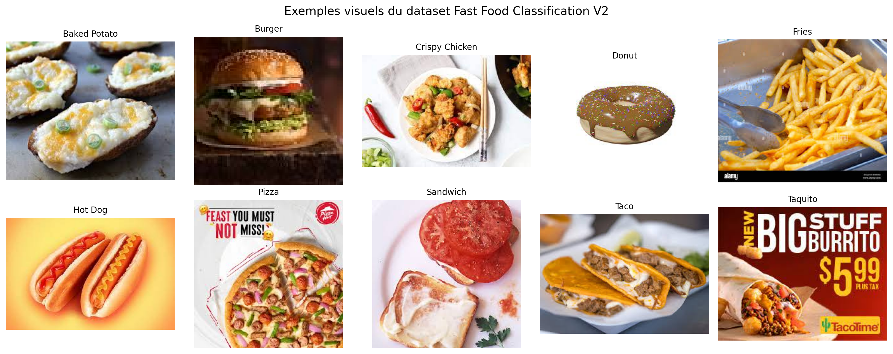
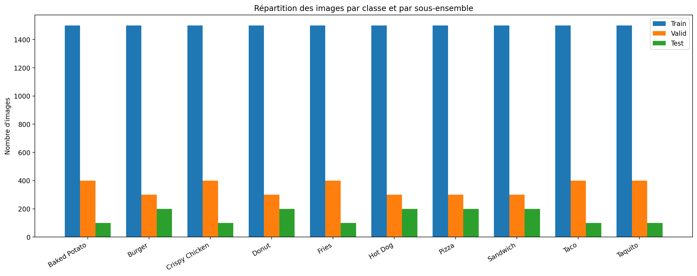
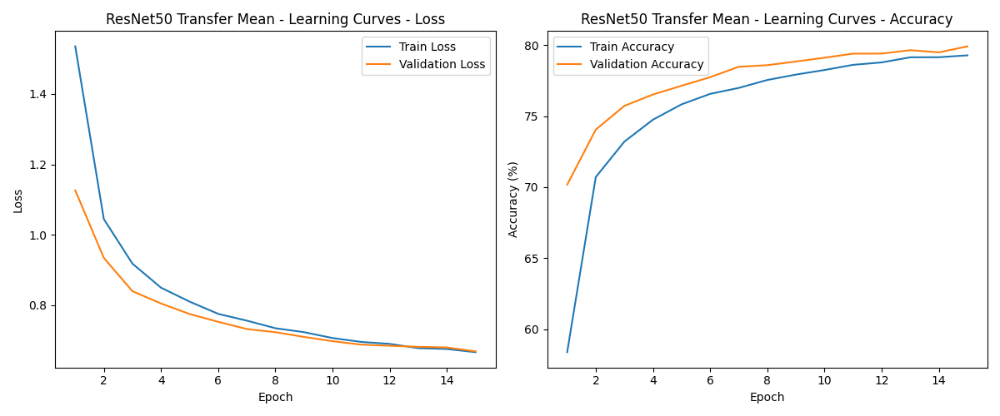
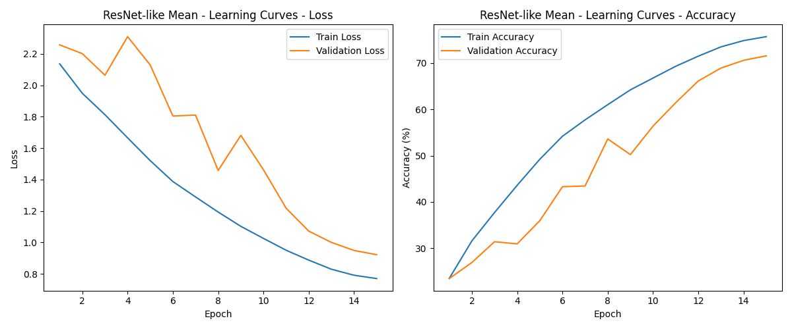
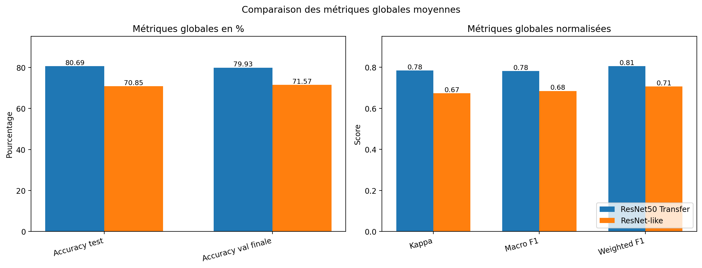
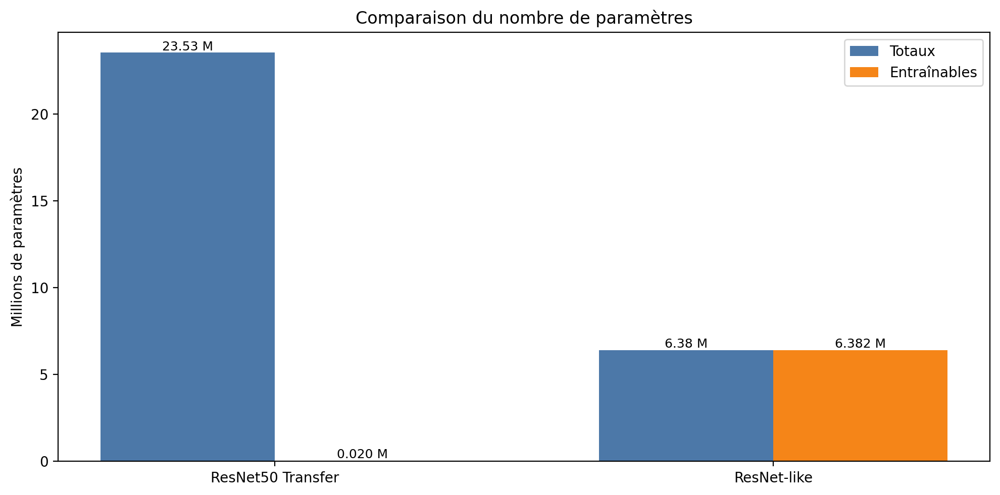
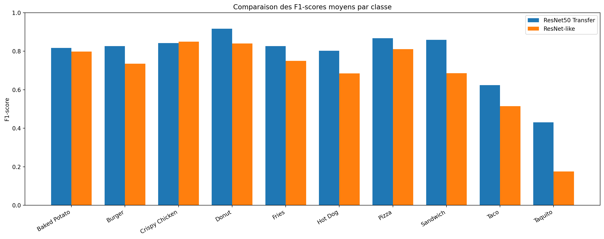
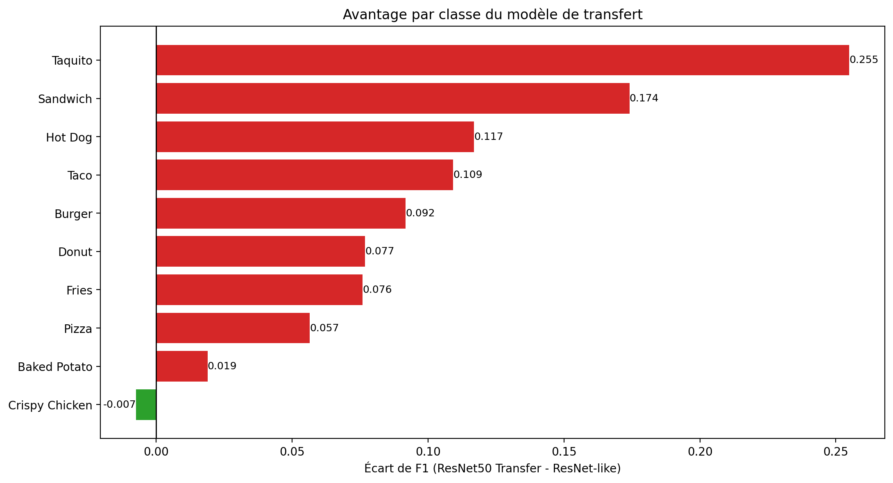
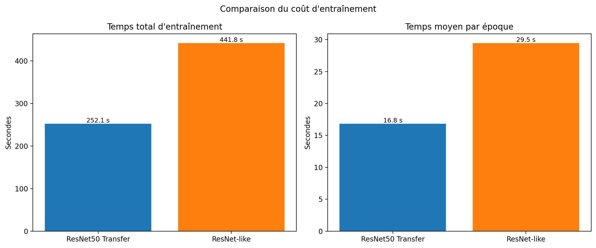

# TP3 - Classification d'images par transfert d'apprentissage et CNN maison

Antoine RIOM et Julien EXCOFFIER  
21 mars 2026

## Utilisation (démarrage rapide)

### 1) Créer et activer un environnement virtuel

```bash
python3 -m venv .venv
source .venv/bin/activate
```

### 2) Installer les dépendances

```bash
pip install --upgrade pip
pip install -r requirements.txt
```

### 3) Lancer les expériences (comparaison des deux approches)

```bash
python3 src/main.py --runs 5 --batch-size 128 --num-workers 8 --transfer-epochs 15 --custom-epochs 15 --custom-model resnet_like --seed-base 42
```

### 4) Ce que permet le projet

- entraîner et comparer un modèle **ResNet50 en transfert d’apprentissage** et un **CNN maison ResNet-like** ;
- répéter les entraînements sur plusieurs seeds ;
- générer les métriques (accuracy, kappa, rapports de classification) ;
- sauvegarder les courbes d’apprentissage et résultats agrégés dans `output/`.

### 5) Désactiver l’environnement virtuel

```bash
deactivate
```

## Introduction

Ce TP porte sur la comparaison de deux approches de classification
d’images vues dans le chapitre consacré aux réseaux de neurones
convolutifs. La première approche repose sur le transfert
d’apprentissage à partir d’un modèle profond pré-entraîné. La seconde
consiste à concevoir et entraîner un CNN maison sur le jeu de données
choisi. Dans les deux cas, la tâche étudiée est une classification
multi-classe d’images RGB représentant différentes catégories de
restauration rapide.

L’intérêt de cette comparaison est double. D’un point de vue pratique,
elle permet d’évaluer si un modèle pré-entraîné apporte un gain clair en
performance, en stabilité et en temps d’entraînement. D’un point de vue
pédagogique, elle permet de relier directement le code réalisé au
contenu du cours: convolutions, normalisation, pooling, structures
résiduelles, augmentation de données et transfert d’apprentissage.

Dans notre implémentation finale, les deux approches sont bien des
**CNN**. Le modèle de transfert utilise *ResNet50*, tandis que le modèle
maison est un CNN résiduel de type *ResNet-like*. Il faut toutefois
préciser qu’ici le terme “finetuning” désigne en pratique un transfert
d’apprentissage avec **backbone gelé** et réentraînement de la seule
couche de classification finale. Le réseau pré-entraîné n’est donc pas
entièrement dégelé.

Notre hypothèse de départ est qu’un modèle pré-entraîné devrait obtenir
de meilleurs résultats et converger plus rapidement, car il bénéficie
déjà de représentations visuelles génériques apprises sur un grand
corpus. À l’inverse, le CNN maison devrait être plus coûteux à
optimiser, mais il permet de mieux comprendre les choix architecturaux
étudiés dans le cours et d’évaluer jusqu’où un apprentissage *from
scratch* peut aller sur ce dataset.

## Présentation du dataset et préparation des données

### Source du dataset

Le jeu de données utilisé dans le projet est téléchargé via `kagglehub`
à partir de la ressource suivante:

> `utkarshsaxenadn/fast-food-classification-dataset`

Le dossier effectivement exploité par les scripts est
`Fast Food Classification V2`. Il contient directement trois
sous-ensembles distincts, `Train`, `Valid` et `Test`. Cette structure
répond bien aux consignes du TP, puisqu’elle permet d’utiliser
exactement les mêmes splits pour les deux approches comparées.

### Classes et répartition des sous-ensembles

Le chargement des images repose sur `torchvision.datasets.ImageFolder`.
Le dataset comporte 10 classes:

> `Baked Potato, Burger, Crispy Chicken, Donut, Fries, Hot Dog, Pizza, Sandwich, Taco, Taquito`

| Classe         | Train | Validation | Test |
|:---------------|------:|-----------:|-----:|
| Baked Potato   |  1500 |        400 |  100 |
| Burger         |  1500 |        300 |  200 |
| Crispy Chicken |  1500 |        400 |  100 |
| Donut          |  1500 |        300 |  200 |
| Fries          |  1500 |        400 |  100 |
| Hot Dog        |  1500 |        300 |  200 |
| Pizza          |  1500 |        300 |  200 |
| Sandwich       |  1500 |        300 |  200 |
| Taco           |  1500 |        400 |  100 |
| Taquito        |  1500 |        400 |  100 |
| Total          | 15000 |       3500 | 1500 |

Répartition des images par classe et par sous-ensemble.

L’ensemble d’entraînement est équilibré, avec 1500 images par classe.
Les ensembles de validation et de test, eux, ne sont pas parfaitement
équilibrés, certaines classes disposant de 100 exemples et d’autres de
200. Cette observation justifie l’usage de métriques complémentaires à
l’accuracy, notamment le *kappa* et le *classification report*.

### Aperçu visuel du dataset

La figure ci-dessous présente un exemple visuel pour chacune des 10
classes. Elle montre bien que certaines catégories sont très distinctes
visuellement, comme *Donut* ou *Pizza*, alors que d’autres présentent
des similarités plus fortes, par exemple *Taco* et *Taquito*, ou encore
*Hot Dog* et *Sandwich*. Cette proximité visuelle se retrouvera plus
loin dans l’analyse des erreurs.



*Exemples visuels des classes du dataset Fast Food Classification V2.*

La figure suivante illustre la répartition des images entre les
sous-ensembles. On y retrouve l’équilibre du jeu d’entraînement et le
léger déséquilibre des jeux de validation et de test.



*Répartition des images par classe et par sous-ensemble.*

### Prétraitements et DataLoaders

Le pipeline final de comparaison est piloté par `src/main.py`. Les deux
modèles utilisent le même principe général pour le chargement des
données: `shuffle=True` pour l’entraînement, `shuffle=False` pour la
validation et le test, avec un batch size de 128 et 8 *workers*.

#### Transformations du modèle maison.

Le fichier `src/dataset.py` applique une transformation d’entraînement
unique et fixe:

- redimensionnement en $224 \times 224$;

- retournement horizontal aléatoire;

- rotation aléatoire de $\pm 15^\circ$;

- *ColorJitter* léger sur la luminosité, le contraste, la saturation et
  la teinte;

- conversion en tenseur.

Pour la validation et le test du modèle maison, les images sont
simplement redimensionnées en $224 \times 224$ puis converties en
tenseurs. Cette stratégie reste volontairement modérée: elle enrichit
les exemples vus pendant l’apprentissage sans dégrader la lisibilité du
protocole.

#### Transformations du modèle de transfert.

Pour *ResNet50*, le pipeline est reconstruit à partir de
`ResNet50_Weights.DEFAULT`. Les images sont converties en RGB,
redimensionnées à 256 pixels, recadrées à $224 \times 224$, puis
normalisées avec la moyenne et l’écart-type associés aux poids
pré-entraînés. L’entraînement utilise un *RandomResizedCrop* et un
retournement horizontal aléatoire, tandis que l’évaluation utilise un
*CenterCrop*.

Ces choix sont cohérents avec les contraintes des deux approches. Le
modèle maison a besoin d’une augmentation simple pour améliorer sa
généralisation. Le modèle pré-entraîné, lui, doit impérativement
recevoir des entrées compatibles avec les statistiques utilisées pendant
le pré-entraînement ImageNet.

## Protocole expérimental

### Conditions communes

Les expériences retenues pour ce rapport correspondent à la session du
21 mars 2026, archivée dans `output/20260321_035423`. Les deux modèles
ont été entraînés avec le même script et avec la même séparation des
données. Les principaux paramètres communs sont les suivants:

- 5 exécutions par modèle;

- graines 42 à 46;

- 15 époques pour chaque approche;

- batch size de 128;

- 8 *DataLoader workers*;

- exécution sur GPU CUDA.

Ce point est important pour la comparaison: contrairement aux premières
itérations du projet, les expériences finales ont été relancées avec un
protocole cohérent, notamment le même nombre d’époques et la même taille
de batch.

### Répétitions et agrégation

Le sujet demandait de répéter plusieurs fois l’apprentissage pour tenir
compte du caractère stochastique de l’optimisation. Cette contrainte a
été respectée via `src/main.py`, qui lance cinq entraînements
indépendants par modèle, sauvegarde chaque run séparément, puis calcule
automatiquement les moyennes et écarts-types des métriques globales et
des rapports de classification.

### Indicateurs de performance

Les métriques demandées dans l’énoncé ont bien été produites:

- l’accuracy globale du classifieur;

- le coefficient de Cohen (*kappa*);

- le `classification_report()` de `sklearn.metrics`;

- les courbes d’apprentissage sur les ensembles d’entraînement et de
  validation.

En complément, nous avons conservé la *test loss*, la meilleure accuracy
de validation, le temps total d’entraînement et le temps moyen par
époque. Ces mesures ne sont pas imposées dans le sujet, mais elles
aident à mieux interpréter les performances réelles des deux approches.

### Environnement matériel et logiciel

Les expériences finales ont été exécutées sur une **NVIDIA RTX 4070**
disposant de **8 Go de VRAM**. Le pipeline repose sur PyTorch et
Torchvision, avec activation d’AMP (*automatic mixed precision*) lorsque
CUDA est disponible. L’utilisation du GPU était nécessaire ici, car la
répétition des expériences et la taille du dataset rendaient
l’entraînement sur CPU trop coûteux en temps.

## Transfert d’apprentissage avec ResNet50

### Architecture retenue

L’approche de transfert d’apprentissage charge un modèle *ResNet50*
pré-entraîné via
`torchvision.models.resnet50(weights=ResNet50_Weights.DEFAULT)`. Toutes
les couches du backbone sont gelées, puis la couche finale `fc` est
remplacée par une couche linéaire adaptée aux 10 classes du dataset.

| Élément                 | Valeur utilisée                              |
|:------------------------|:---------------------------------------------|
| Architecture            | ResNet50 pré-entraîné                        |
| Type d’approche         | Transfert d’apprentissage avec backbone gelé |
| Couche réentraînée      | `fc`                                         |
| Nombre de classes       | 10                                           |
| Fonction de coût        | `CrossEntropyLoss`                           |
| Optimiseur              | `Adam`                                       |
| Taux d’apprentissage    | `1e-3`                                       |
| Nombre d’époques        | 15                                           |
| Batch size              | 128                                          |
| Paramètres totaux       | 23 528 522                                   |
| Paramètres entraînables | 20 490                                       |

Configuration du modèle de transfert.

Ce choix est cohérent avec le cours, où les architectures résiduelles
apparaissent comme des CNN profonds efficaces et stables à entraîner.
*ResNet50* fournit ici une base solide pour étudier le transfert
d’apprentissage sans ajouter une complexité inutile dans le code.

### Résultats



*Courbes d’apprentissage moyennes du modèle ResNet50 Transfer sur 5 exécutions.*

| Métrique                   | Moyenne  | Écart-type |
|:---------------------------|:--------:|:----------:|
| Accuracy test              |  80.69%  |  0.32 pt   |
| Kappa                      |  0.7836  |   0.0035   |
| Macro F1                   |  0.7813  |   0.0046   |
| Weighted F1                |  0.8057  |   0.0034   |
| Loss test                  |  0.6198  |   0.0094   |
| Accuracy validation finale |  79.93%  |  0.36 pt   |
| Temps d’entraînement total | 252.08 s |   7.87 s   |
| Temps moyen par époque     | 16.81 s  |   0.52 s   |

Résultats agrégés du transfert d’apprentissage sur 5 exécutions.

Les courbes montrent une convergence rapide et régulière. Dès les
premières époques, la validation dépasse 70%, puis se stabilise autour
de 80%. L’écart entre entraînement et validation reste faible, ce qui
suggère une bonne capacité de généralisation. Le backbone gelé agit ici
comme une base de représentations robuste, déjà adaptée à l’extraction
de motifs visuels utiles.

### Analyse

Le modèle de transfert obtient les meilleurs résultats globaux du
projet. Les classes les mieux reconnues sont *Donut* (F1 moyen 0.9171),
*Pizza* (0.8674), *Sandwich* (0.8594) et *Crispy Chicken* (0.8426). Les
classes les plus difficiles restent *Taco* (0.6239) et surtout *Taquito*
(0.4306), ce qui est cohérent avec leur proximité visuelle et leur
support plus faible dans le jeu de test.

Le *kappa* moyen de 0.7836 indique une très bonne concordance entre les
prédictions et la vérité terrain au-delà de ce qui serait obtenu par
hasard. La stabilité entre les runs est également excellente, avec
seulement 0.32 point d’écart-type sur l’accuracy test. Cela fait du
transfert d’apprentissage une solution à la fois performante et fiable
dans ce contexte. Il est intéressant de noter qu’ici *ResNet50* possède
beaucoup de paramètres au total, mais très peu de paramètres réellement
optimisés, puisque seul le classifieur final est entraînable.

## CNN maison: modèle ResNet-like

### Prototype initial et choix du modèle final

Avant de retenir `ResNetLikeClassifier`, un premier prototype plus
simple a été testé: `FastFoodClassifier`, également défini dans
`src/models.py`. Ce modèle repose sur une succession de convolutions et
activations ReLU, suivies d’un *global average pooling* et d’une couche
de sortie. Il ne possède que **395 178 paramètres entraînables**, ce qui
en fait une architecture légère. Lors des essais préliminaires, il
obtenait toutefois des résultats moyens, de l’ordre de **50%
d’accuracy**, ce qui restait insuffisant pour une comparaison ambitieuse
avec le transfert d’apprentissage.

Ce constat nous a conduits à adopter une architecture plus expressive,
le modèle *ResNet-like*, plus proche des concepts vus en cours. Le
passage à un modèle résiduel plus profond était motivé par la nécessité
d’améliorer la propagation du gradient, d’apprendre des représentations
plus riches et de mieux exploiter la taille du dataset.

### Architecture retenue et rôle des composants

Le modèle maison réellement utilisé pour la comparaison finale est donc
le classifieur *ResNet-like*. Il s’agit d’un CNN résiduel composé:

- d’une convolution d’entrée $5 \times 5$ avec stride 2;

- d’une *batch normalization* suivie d’une activation ReLU;

- de six blocs convolutionnels résiduels organisés en trois groupes;

- d’une augmentation progressive du nombre de canaux: 64, 128, 256 puis
  512;

- d’un *global average pooling* avant la couche de classification
  finale.

| Élément                 | Valeur utilisée                |
|:------------------------|:-------------------------------|
| Architecture            | CNN résiduel *ResNet-like*     |
| Entrée                  | Images RGB en $224 \times 224$ |
| Fonction de coût        | `CrossEntropyLoss`             |
| Optimiseur              | `AdamW`                        |
| Taux d’apprentissage    | `1e-3`                         |
| Weight decay            | `1e-4`                         |
| Scheduler               | `CosineAnnealingLR`            |
| Nombre d’époques        | 15                             |
| Batch size              | 128                            |
| Paramètres totaux       | 6 382 410                      |
| Paramètres entraînables | 6 382 410                      |

Configuration du modèle maison.

Chaque choix architectural a un rôle précis:

- la **batch normalization** stabilise la distribution des activations,
  accélère généralement l’apprentissage et rend l’optimisation plus
  robuste;

- les **connexions résiduelles** facilitent la circulation du gradient
  et limitent les difficultés liées à la profondeur du réseau;

- le **global average pooling** remplace des couches entièrement
  connectées plus lourdes, réduit le nombre de paramètres et force le
  modèle à résumer spatialement les cartes de caractéristiques avant la
  décision finale;

- le **scheduler CosineAnnealingLR** diminue progressivement le taux
  d’apprentissage, ce qui permet des mises à jour plus agressives au
  début puis plus fines en fin d’entraînement;

- **AdamW** aide à régulariser le modèle grâce au *weight decay*, ce qui
  est utile lorsqu’on entraîne un CNN from scratch.

Cette architecture plus sophistiquée que le prototype initial a permis
d’obtenir des résultats nettement meilleurs, même si elle reste en
retrait par rapport au modèle de transfert. Elle constitue un bon
compromis entre expressivité et coût d’entraînement pour un
apprentissage sans pré-entraînement.

### Résultats



*Courbes d’apprentissage moyennes du modèle ResNet-like sur 5 exécutions.*

| Métrique                   | Moyenne  | Écart-type |
|:---------------------------|:--------:|:----------:|
| Accuracy test              |  70.85%  |  0.34 pt   |
| Kappa                      |  0.6736  |   0.0042   |
| Macro F1                   |  0.6845  |   0.0050   |
| Weighted F1                |  0.7068  |   0.0043   |
| Loss test                  |  0.8756  |   0.0124   |
| Accuracy validation finale |  71.57%  |  0.58 pt   |
| Temps d’entraînement total | 441.81 s |   8.61 s   |
| Temps moyen par époque     | 29.45 s  |   0.57 s   |

Résultats agrégés du modèle maison sur 5 exécutions.

Les courbes montrent une progression plus lente que pour le transfert
d’apprentissage, mais néanmoins régulière. L’accuracy de validation
croît encore sur les dernières époques et ne semble pas avoir
complètement atteint son plafond. Autrement dit, le modèle paraît encore
perfectible et pourrait probablement gagner quelques points d’accuracy
avec davantage d’époques ou une recherche d’hyperparamètres plus
poussée. Nous avons cependant choisi de nous arrêter à 15 époques pour
conserver un protocole comparable avec le modèle de transfert et limiter
le coût d’entraînement total.

### Analyse

Le modèle maison obtient des résultats honorables pour un apprentissage
sans pré-entraînement. Ses meilleures classes sont *Crispy Chicken* (F1
moyen 0.8499), *Donut* (0.8403), *Pizza* (0.8109) et *Baked Potato*
(0.7978). En revanche, les performances chutent fortement sur *Taco*
(0.5146) et surtout *Taquito* (0.1757). Les classes *Hot Dog* et
*Sandwich* restent également difficiles.

Le comportement du modèle est cohérent avec son cadre d’apprentissage:
il doit construire lui-même ses représentations visuelles à partir du
seul dataset cible. Malgré l’apport des blocs résiduels, de la
normalisation de lot et du scheduler, le coût d’optimisation reste
élevé. Le point positif est sa bonne stabilité d’un run à l’autre. Le
point limitant est son retard net par rapport au modèle pré-entraîné,
aussi bien en précision qu’en temps d’entraînement.

## Comparaison des deux approches

### Lecture des métriques globales

| Approche               | Acc. test | Kappa  | Macro F1 | Weighted F1 |  Temps   | $\sigma$ acc. |
|:-----------------------|:---------:|:------:|:--------:|:-----------:|:--------:|:-------------:|
| ResNet50 Transfer      |  80.69%   | 0.7836 |  0.7813  |   0.8057    | 252.08 s |    0.32 pt    |
| CNN maison ResNet-like |  70.85%   | 0.6736 |  0.6845  |   0.7068    | 441.81 s |    0.34 pt    |

Comparaison finale des deux approches sur 5 exécutions.



*Comparaison des principales métriques globales entre les deux modèles.*



*Comparaison du nombre de paramètres totaux et entraînables.*

L’accuracy mesure la proportion globale d’images correctement classées.
Ici, le modèle de transfert dépasse le CNN maison d’environ **9.84
points**, ce qui signifie très concrètement qu’il commet nettement moins
d’erreurs sur le jeu de test.

Le coefficient de *kappa* mesure la concordance entre prédictions et
vérité terrain en corrigeant l’effet du hasard. Le fait que *ResNet50
Transfer* atteigne **0.7836** contre **0.6736** pour le modèle maison
montre que son avantage ne s’explique pas seulement par la répartition
des classes: il produit une décision globalement plus fiable.

Le **macro F1** accorde le même poids à chaque classe. Sa valeur plus
élevée pour le transfert (**0.7813** contre **0.6845**) signifie que le
modèle pré-entraîné ne se contente pas de bien reconnaître les classes
faciles ou fréquentes; il reste aussi plus équilibré sur les classes
difficiles. Le **weighted F1**, qui prend en compte le support de chaque
classe, reste lui aussi nettement supérieur pour le transfert
(**0.8057** contre **0.7068**). L’avantage est donc visible à la fois en
moyenne uniforme et en moyenne pondérée.

Enfin, la *test loss* plus faible du modèle de transfert (**0.6198**
contre **0.8756**) suggère que ses prédictions sont non seulement plus
souvent correctes, mais aussi généralement plus sûres.

La comparaison du nombre de paramètres nuance cependant
l’interprétation. Le modèle de transfert repose sur un réseau bien plus
volumineux au total (**23.53 M** de paramètres) que le modèle maison
(**6.38 M**). En revanche, à cause du gel du backbone, seuls **20 490
paramètres** sont réellement entraînés dans notre protocole de
transfert, contre **6.38 M** pour le CNN maison. Cela explique en partie
pourquoi le transfert est à la fois plus rapide et plus performant: il
exploite une très grande capacité de représentation héritée du
pré-entraînement, sans avoir à optimiser l’ensemble de cette capacité
sur notre dataset.

### Comparaison explicite par classe



*Comparaison des F1-scores moyens par classe.*



*Écart de F1-score entre ResNet50 Transfer et ResNet-like.*

L’analyse par classe permet de préciser la nature de l’écart observé. Le
transfert est meilleur sur **9 classes sur 10**. Les gains les plus
marqués apparaissent pour:

- *Taquito*: $+0.2549$ de F1;

- *Sandwich*: $+0.1741$;

- *Hot Dog*: $+0.1169$;

- *Taco*: $+0.1093$;

- *Burger*: $+0.0917$.

Ces classes semblent donc bénéficier tout particulièrement des
représentations pré-entraînées. Le cas de *Taquito* est le plus parlant:
le modèle maison y échoue largement, alors que le transfert reste
difficile mais beaucoup moins dégradé.

La seule classe où le CNN maison fait légèrement mieux est *Crispy
Chicken*, avec un F1 de 0.8499 contre 0.8426 pour le transfert. Cet
écart reste toutefois faible et ne remet pas en cause la tendance
générale. Les classes *Baked Potato* et *Pizza* montrent des écarts plus
modérés, ce qui suggère qu’elles sont déjà relativement bien séparables
visuellement.

### Coût computationnel et stabilité



*Comparaison des temps d’entraînement des deux approches.*

Le modèle de transfert est aussi plus rapide. Il faut en moyenne
**252.08 s** pour 15 époques, contre **441.81 s** pour le modèle maison,
soit environ **190 s** de moins. Ce résultat peut sembler
contre-intuitif, car *ResNet50* est un réseau profond. Pourtant, le
backbone étant gelé, l’optimisation ne concerne essentiellement que la
couche finale, alors que le CNN maison doit ajuster l’ensemble de ses
paramètres.

En termes de stabilité, les deux modèles sont assez réguliers. Les
écarts-types d’accuracy restent faibles dans les deux cas: 0.32 point
pour le transfert et 0.34 point pour le CNN maison. Le transfert est
donc à la fois plus performant, plus rapide et légèrement plus stable.

### Discussion et limites

Les résultats montrent clairement que le transfert d’apprentissage
constitue ici la meilleure solution pratique. Le gain n’est pas
seulement visible sur l’accuracy: il se retrouve sur le *kappa*, sur le
macro F1, sur le weighted F1, sur la loss et sur le temps
d’entraînement. Cela signifie que le modèle pré-entraîné réussit mieux à
équilibrer précision et rappel, y compris sur les classes difficiles.

Cette étude présente néanmoins plusieurs limites. D’abord, le
“finetuning” n’est pas complet: seul le classifieur final de *ResNet50*
est réentraîné. Un dégel partiel du backbone pourrait possiblement
améliorer encore les résultats. Ensuite, le CNN maison semble ne pas
avoir atteint son plafond d’apprentissage après 15 époques. Une
poursuite de l’entraînement, un changement de scheduler ou une
exploration plus systématique des hyperparamètres pourraient lui
permettre de récupérer quelques points. Enfin, même si cinq répétitions
donnent déjà une estimation sérieuse de la stabilité, un nombre encore
plus élevé renforcerait la robustesse statistique de la comparaison.

## Conclusion

Au terme de cette étude, le transfert d’apprentissage avec *ResNet50*
apparaît comme l’approche la plus efficace pour ce problème. Il offre
les meilleures performances globales, la meilleure robustesse sur les
classes difficiles et un coût d’entraînement plus faible que le modèle
maison. Dans un cadre applicatif, c’est donc le choix que nous
recommanderions.

Le CNN *ResNet-like* reste toutefois très formateur. Sa conception nous
a permis de mobiliser plusieurs notions vues dans le chapitre sur les
réseaux de neurones convolutifs: rôle des convolutions, normalisation de
lot, *pooling*, blocs résiduels, augmentation de données et stratégie
d’optimisation. En ce sens, le modèle maison remplit pleinement
l’objectif pédagogique du TP, même s’il reste en retrait face à une
architecture pré-entraînée.

## Éléments de reproductibilité

Les expériences finales du rapport ont été générées avec:

> `python3 src/main.py --runs 5 --batch-size 128 --num-workers 8 --transfer-epochs 15 --custom-epochs 15 --custom-model resnet_like --seed-base 42`

La session utilisée ici est:

> `output/20260321_035423`

## Rapports de classification moyens

### Transfert d’apprentissage

| Classe         | Precision | Recall | F1-score |
|:---------------|:---------:|:------:|:--------:|
| Baked Potato   |  0.7375   | 0.9160 |  0.8167  |
| Burger         |  0.9286   | 0.7460 |  0.8269  |
| Crispy Chicken |  0.7772   | 0.9200 |  0.8426  |
| Donut          |  0.9000   | 0.9350 |  0.9171  |
| Fries          |  0.8104   | 0.8440 |  0.8261  |
| Hot Dog        |  0.8494   | 0.7600 |  0.8020  |
| Pizza          |  0.9323   | 0.8110 |  0.8674  |
| Sandwich       |  0.8455   | 0.8740 |  0.8594  |
| Taco           |  0.4994   | 0.8340 |  0.6239  |
| Taquito        |  0.5952   | 0.3380 |  0.4306  |
| Macro avg      |  0.7876   | 0.7978 |  0.7813  |
| Weighted avg   |  0.8221   | 0.8069 |  0.8057  |

Rapport de classification moyen du modèle *ResNet50 Transfer*.

### CNN maison

| Classe         | Precision | Recall | F1-score |
|:---------------|:---------:|:------:|:--------:|
| Baked Potato   |  0.7163   | 0.9020 |  0.7978  |
| Burger         |  0.7910   | 0.6870 |  0.7351  |
| Crispy Chicken |  0.8047   | 0.9020 |  0.8499  |
| Donut          |  0.8111   | 0.8730 |  0.8403  |
| Fries          |  0.6856   | 0.8300 |  0.7502  |
| Hot Dog        |  0.7499   | 0.6320 |  0.6851  |
| Pizza          |  0.8914   | 0.7440 |  0.8109  |
| Sandwich       |  0.7254   | 0.6500 |  0.6853  |
| Taco           |  0.4198   | 0.6660 |  0.5146  |
| Taquito        |  0.2014   | 0.1560 |  0.1757  |
| Macro avg      |  0.6797   | 0.7042 |  0.6845  |
| Weighted avg   |  0.7177   | 0.7085 |  0.7068  |

Rapport de classification moyen du modèle *ResNet-like*.

## Références

- Dataset Kaggle: [Fast Food Classification
  Dataset](https://www.kaggle.com/datasets/utkarshsaxenadn/fast-food-classification-dataset)

- Documentation PyTorch/Torchvision pour *ResNet50* et
  `ResNet50_Weights.DEFAULT`

- Maitre, Julien. *Chapitre 11 — Réseaux de neurones convolutifs*, cours
  8INF883 *Vision artificielle et traitement des images*, Université du
  Québec à Chicoutimi, hiver 2025
